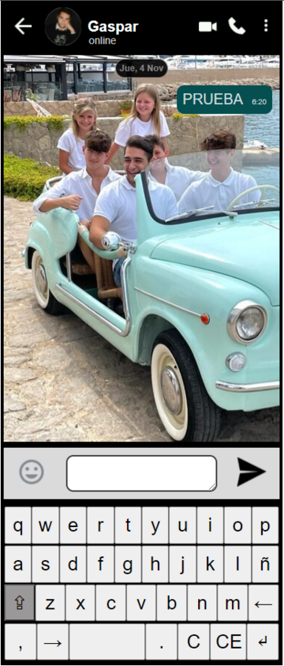
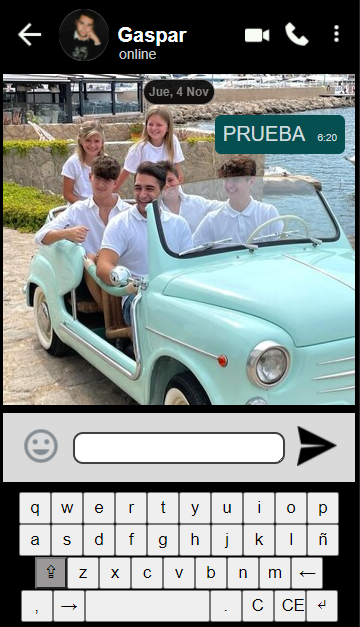
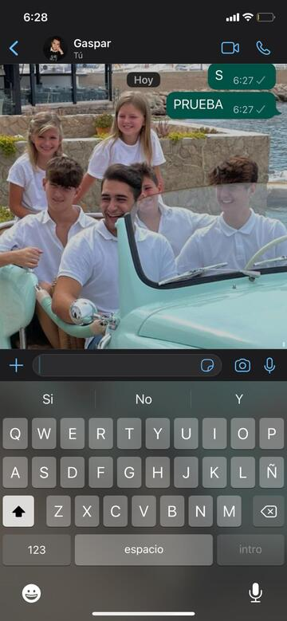

# Whatsagram
## Vista en ordenador:

## Vista en teléfono (Samsumg S9):

## Vista en teléfono inspirado (Iphone 11):

# **1 Intro**
Aquesta projecte consisteix en crear una petita aplicació de missatgeria, el  *Whatsagram.* Aquesta aplicació està inspirada en una app de missatgeria, amb alguns petits canvis.

You should create a **responsive** interface for desktop and mobile phone.

Cada apartat té un color d’etiqueta depenent de si pertany a DIW o DWEC (o a les dues)
# **2 General**

|**PROJ**|[x] Segueix les [**Pautes de treball en Projectes**](https://docs.google.com/document/d/1ImIv0MihaxZJWmHPFyxGdp0GTb1QVYFfaTlQVcjVF_w/edit#heading=h.hxgmnv2vpkaw) vistes a classe|
| :-: | :- |
|**TODO**|
 [x] Fer una **TODO LIST** amb els requisits de la pràctica (basta posar el codi i una petita descripció)

Si has fet la funcionalitat, marca casella del item. Si no, deixa-la buida.

Si has trobat problemes o vols comentar l’estat de l’item, escriu-ho
|

# **3 Funcionalitat bàsica**

|**INTER**|
 [x] L’app tendrà una interfície gràfica similar a les aplicacions de missatgeria Whatsapp i Telegram.

 [x] L’app té tres zones bàsiques: la **messaging area**, la **text area** (amb **emoji button** i **send button**) i **keyboard area.**

 [x] L’usuari escriu els missatges a la **text area** i en clicar el botó d’enviament, els missatges s’envien a la **messaging area.**
|
| :-: | :- |
|**MESSAG**|
 [x] La **messaging area** conté els missatges escrits.

 [x] La **data** d’enviament s’escriu sobre els missatges en el format indicat (en l’idioma que vulgueu): Exemple:       *25 Maig*   

 [x] Els missatges contenen l’**hora d’enviament** amb format establert  *hora:minuts*. Les hores i minuts sortiran amb 2 caràcters, exemples:   *10:28,  09:45*,  *18:03*
|
|**TEXTAR**|[x] En la **text area** escrivim missatges.  Escrivim emprant les tecles de la **keyboard area** o el teclat de l’ordinador  En pulsar el **send button**, el missatge se mostra en la **messaging area**.|
|**KEYB**|
 [x] En la **keyboard area** hi haurà tecles de lletres i funcions.

 [x] Tecles de lletres: han de sortir totes les habituals.

 [x] No importa que funcionin totes les tecles de lletres.

 [ ] Extra: crea, emprant un bucle, els callbacks per a totes les tecles → ([**PILLS FOR PROJECTS**](https://docs.google.com/document/d/1gZEaNmGWozIszMdxu9M_M-ZHlvUd3FIuKYVFJD94CS0/edit#heading=h.mmjdukqnka12))  
|
|**EMOJI**|
 [x] En clicar sobre **GIF,** se mostren els *emojis* (mínim de 3)  i  la icona “GIF” se canvia per la icona d’un teclat.  

 [x] En clicar sobre un emoji, s’envia un missatge amb aquell emoji (en una mida adequada, ni massa gran ni massa petita).
|

## **Tecles Especials**

|**CEC**|
 [x] La tecla **C** esborra el text de la **text area.**

 [x] La tecla **CE** esborra la darrera paraula de la **text area** (si els darrers caràcters escrits són 1 o més espais, esborra la paraula abans dels espais).
|
| :-: | :- |
|**DELET**|
 [x] La tecla  **←**  esborra el darrer caràcter escrit a la **text area.**

 [x] La tecla **→**  esborra el primer caracter escrit** a la **text area.**
|
|**MAJUS**|
 [x] S’han de mostrar visualment els diferents estats de la tecla  **Majuscules** (desactivat / 1 caracter en majúscules / majúscules permanents).

 [x] ATENCIÓ: La tecla majúscula només funciona en escriure amb tecles de la **keyboard area.**

 [x] En clicar 1 cop, escriu en majúscula el següent caràcter i se desactiva la funció majúscules.  

 [x] Si clicam 2 vegades, s’escriu permanentment en majúscules.

 [x] Les majúscules permanents es desactiven clicant sobre la tecla de majúscules.
|
|**ESPAI**|
 [x] S’escriu un espai en la **text** **area** cada cop que s’espitja aquella tecla

 [x] ALERTA!  En enviar el missatge a la **messaging area**, els espais s’han de mostrar
|
|**SALT**|
 [x] S’escriu un espai en la **text** **area** cada cop que s’espitja aquella tecla

 [x] En enviar el missatge a la **messaging area**, els espais han d’aparèixer també.
|

# **4 CSS and Visual Requirements**

|**GRID**| [x] Use **Grid** to create the main layout of the page|
| :-: | :- |
|**FLEX**| [x] Use **Flexbox** to display the keys of the keyboard (i també pots emplear Flexbox on sigui útil)|
|**RESP**| [x] The layout should be **responsive** for mobile phone (exemple: Chrome, vista *Samsung **Galaxy S5***)|
|**CENTR**| [x] En la vista per desktop, l’aplicació estarà centrada en el viewport|
|**KEYS**| [x] Create visual effects on the buttons of the calculator: change appearance of the buttons on **hover** and when **clicking/activating** on a button|
|**FONTS**| [x] Select one suitable **Google Font** and specify it in the README   ([**PILLS FOR PROJECTS**](https://docs.google.com/document/d/1gZEaNmGWozIszMdxu9M_M-ZHlvUd3FIuKYVFJD94CS0/edit#))  |

# **5 Technical Requirements**

|**VARS**| [x] Empra CSS Variables per indicar els **colors** del teu CSS  ([**PILLS FOR PROJECTS**](https://docs.google.com/document/d/1gZEaNmGWozIszMdxu9M_M-ZHlvUd3FIuKYVFJD94CS0/edit#))  |
| :-: | :- |
|**STYLE**| [x] Segueix la [Guia d'Estil de DIW](https://docs.google.com/document/d/1XgEweoKsHu3U7dW0ieL5uvmHPCljXzoBcc3HAqEd9Ms/edit#) per escriure estils nets, ordenats i clars.|
|**STYLE**| [x] Segueix la [Guia d'Estil de DWEC](https://docs.google.com/document/d/14XmBU8qXZmJogA8R4YJPTjL-tCHOjUC3AL2Crt5XUEo/edit) per crear un codi clar i ben escrit.|
|**SEPAR**| [x] Escriure el codi js en un fitxer **script.js**|

# **6 EXTRA**

|**EMOJ**| [x] Incorpora la possibilitat d’enviar emojis inserits a dins dels missatges de text.|
| :-: | :- |
|**PENJA**| [x] Penja emprant *Netlify* com veurem a classe, per a desplegar el teu projecte.|

# **7 Fuentes**
Las fuentes utilizadas en el proyecto: **Roboto Condensed y Open Sans.**

## | TODO list |
- [x] Crear raíz dev
- [x] Crear README.md
- [x] Estructura de carpetas
- [x] Crear zonas básicas [messaging area, text area (amb emoji button i send button) y keyboard area]
- [x] Funcionalidad teclas
- [x] Enviar texto a missageArea
- [x] Crear Interfaz
- [x] Emojis